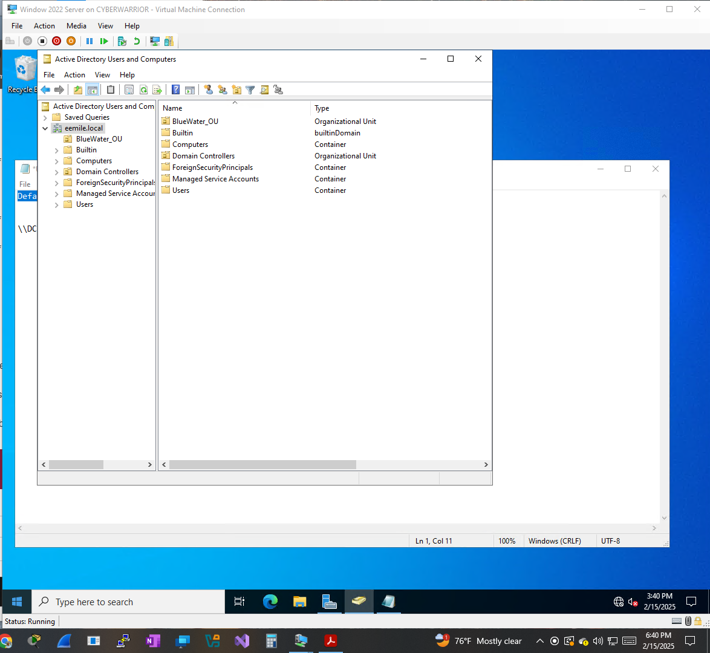
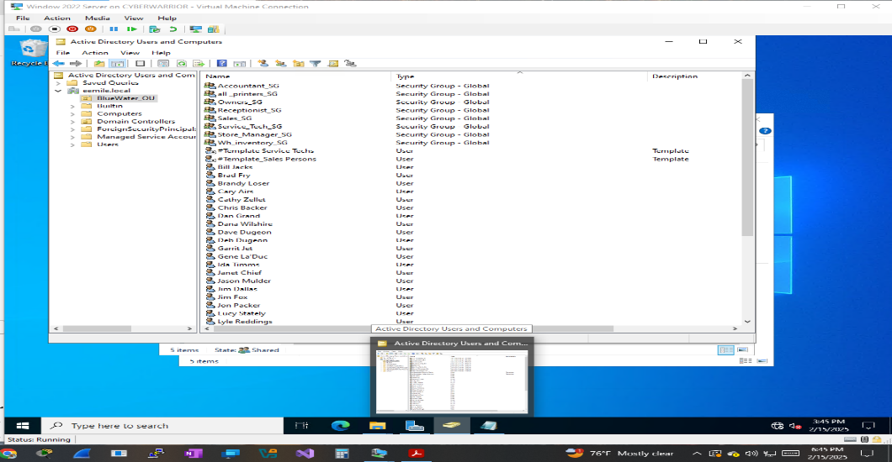
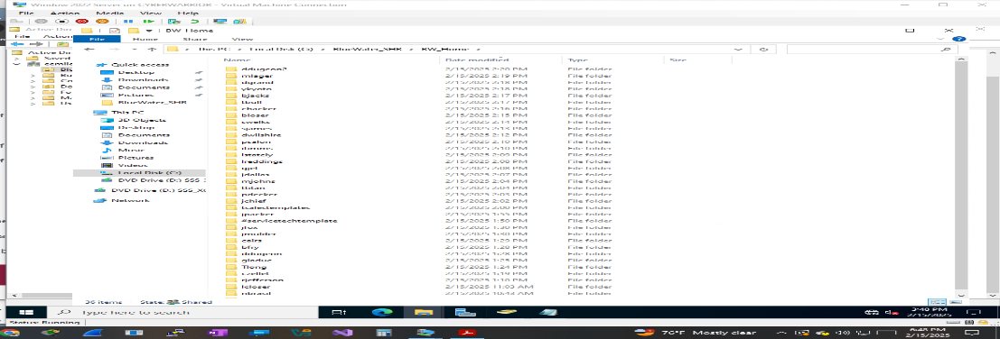

# 🏢 Active Directory Design — BlueWater Company Case

> Small-business Active Directory implementation: OU design, naming conventions, security groups, shared directories, and role-based access — built and verified on a live Windows Server 2022 domain controller.

A hands-on Active Directory design lab based on a company case study, built and verified on a **Windows Server 2022 domain controller**. The implementation translates a small-business scenario into a working AD structure with real naming decisions, access scoping, and edge cases resolved along the way.

---

## 🎯 Objectives

This lab was designed to demonstrate the ability to:

* Design an Organizational Unit (OU) structure appropriate to a company's actual size
* Establish and apply a consistent account naming convention, including a fallback for collisions
* Create security groups aligned to functional business roles, not arbitrary categories
* Configure shared directories with permissions scoped to the correct audience
* Apply logon-hour restrictions and delegated rights based on real operational need

---

## 🏢 Environment

| Component | Configuration |
|---|---|
| Operating System | Windows Server 2022 |
| Directory Service | Active Directory Domain Services |
| Management Tool | Active Directory Users and Computers |
| Company scenario | BlueWater (small business) |
| OU Model | Single flat OU |

---

## 🗂️ 1. Organizational Unit Design

Rather than a deep OU hierarchy, everything lives under one `BlueWater_OU`. For a company this size, a single OU keeps administration simple without sacrificing the ability to apply group policy or delegate permissions later if the company grows.

---

## 🏷️ 2. Naming Convention

**Pattern:** first initial + last name (e.g., Steve Brasil → `sbrasil`)

### 🔎 Edge Case Encountered

Two employees — **Deb Dugeon** and **Dave Dugeon** — both resolve to `ddugeon` under that pattern. Resolved by appending a numeric suffix to the second account: `ddugeon`, `ddugeon1`.

**Why this matters:** a naming convention that hasn't been tested against a collision isn't actually a convention yet — it's a guess. Catching this before it became a real support ticket is the actual point of the exercise.

---

## 👥 3. Security Groups

Groups named by function, with a consistent `_SG` suffix so any permissions dialog immediately shows which entries are access-control groups versus individual accounts:

| Group | Purpose |
|---|---|
| `Sales_SG` | Sales staff |
| `Service_Tech_SG` | Service technicians |
| `Accountant_SG` | Accounting staff |
| `Store_Manager_SG` | Store managers |
| `All_Printers_SG` | Printer access |
| `Owners_SG` | Ownership-level access |
| `Receptionist_SG` | Front-desk staff |

---

## 📁 4. Shared Directories

Directories named by audience, with permissions matched to that audience:

| Directory | Audience | Access |
|---|---|---|
| `Public_SHR` | All employees | Read/Write |
| `Service_Techs_SHR` | Service technicians | Read/Write |
| `Accountants_SHR` | Accounting staff | Read/Write |

Every user also received an individual home directory.

---

## 🔑 5. Role-Based Restrictions and Delegation

**Logon-hour restrictions** — the Sales security group is restricted to 9 AM–9 PM logon hours, matching actual working hours instead of allowing 24/7 access by default.

**Scoped Domain Admin delegation** — specific individuals (`sbrasil`, `rjefferson`) were added to Domain Admins based on an actual need for that access level, not by default.

**Scoped Print Operator rights** — granted only to the small set of users responsible for managing the shared printer, not broadly.

---

## 🧠 Key Concepts This Reflects

1. **Right-sized design** — a single OU is the correct choice for this company's size; more structure would add complexity without benefit.
2. **Naming convention resilience** — a convention is only as good as its handling of real collisions.
3. **Access scoped to audience** — shared directory and printer permissions matched to who actually needs them.
4. **Time-based access control** — logon-hour restrictions applied where they reflect real working patterns.

---

## 🎓 Background

Developed while studying Active Directory Management as part of a B.S. in Information Technology, applied to a small-business AD design scenario.
