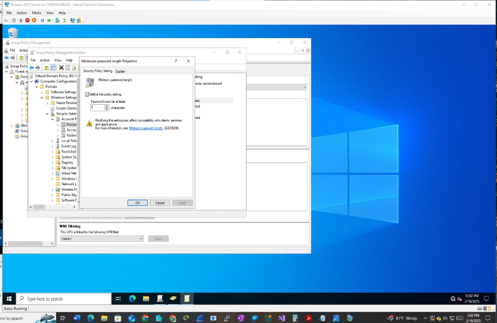
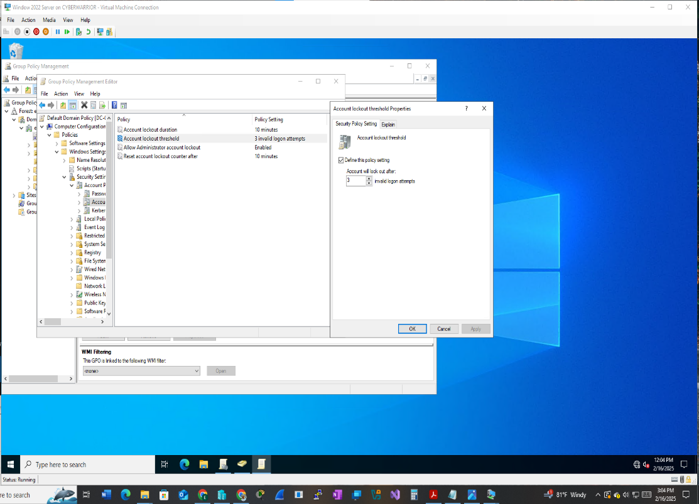
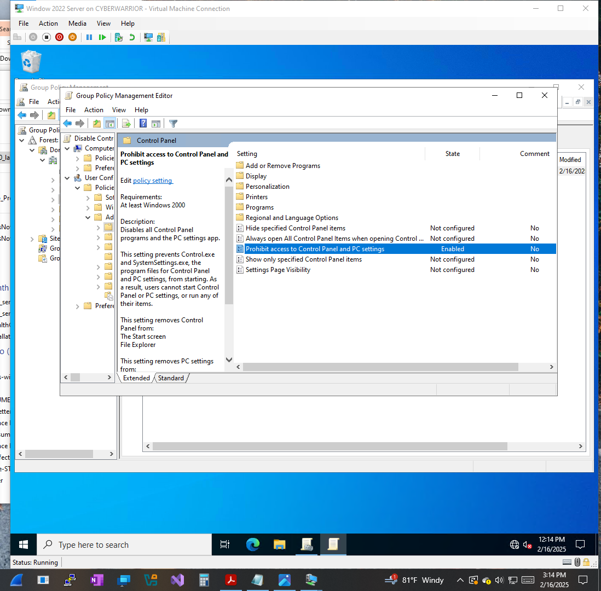
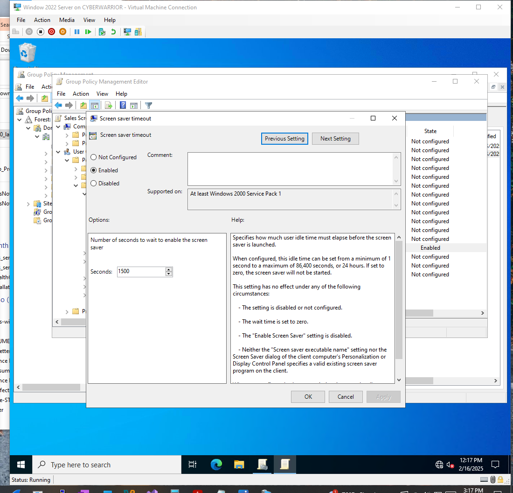
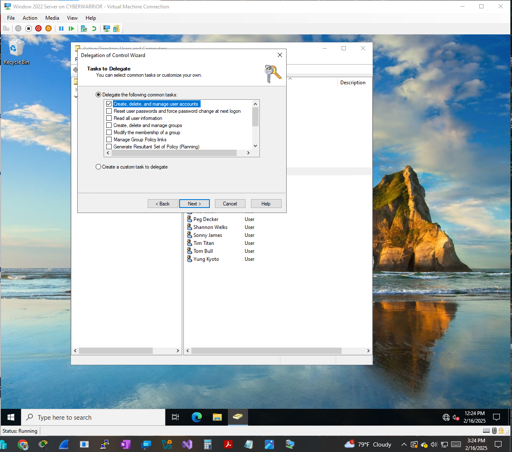

# 🔐 Group Policy Implementation — Sales Department

> Enterprise Active Directory security baseline + department-scoped Group Policy + least-privilege administrative delegation

A hands-on Active Directory security lab built and verified on a **Windows Server 2022 domain controller**. The implementation demonstrates how to separate domain-wide security controls from department-specific configuration, while applying least privilege to delegated administration.

---

## 🎯 Objectives

This lab was designed to demonstrate the ability to:

* Configure domain-wide password and account lockout policies
* Design and organize department-specific Organizational Units (OUs)
* Create and link security-focused Group Policy Objects (GPOs)
* Apply policies to a specific department without affecting the entire domain
* Delegate administrative privileges using the Delegation of Control Wizard
* Apply the principle of least privilege to Active Directory administration

---

## 🏢 Environment

| Component | Configuration |
|---|---|
| Operating System | Windows Server 2022 |
| Directory Service | Active Directory Domain Services |
| Policy Management | Group Policy Management Console (GPMC) |
| Department scoped | Sales |
| Administrative Model | Delegated / Least Privilege |

---

## 🔒 1. Domain-Wide Security Policy

Security baseline settings were configured through the Default Domain Policy, ensuring the controls apply across the domain rather than being limited to a single department.

**Password Policy**
* Minimum password length: **8 characters**



**Account Lockout Policy**

| Setting | Configuration |
|---|---|
| Lockout threshold | 3 invalid attempts |
| Lockout duration | 10 minutes |
| Reset lockout counter | 10 minutes |
| Administrator account lockout | Enabled |



### 🔎 Security Consideration

The built-in Administrator account is commonly overlooked when designing account lockout protections — Windows exempts it from lockout by default. Explicitly enabling this control closes that gap and reduces the exposure of the domain's highest-privilege account to repeated authentication attempts.

**Security principle:** Protect privileged identities as carefully as — or more carefully than — standard user accounts.

---

## 👥 2. Sales Organizational Unit

A dedicated **Sales OU** was created and Sales user accounts were moved into it, establishing a policy boundary so department-specific GPOs could be applied without affecting users elsewhere in the domain.

---

## 🛡️ 3. Sales Department GPOs

Two GPOs were created and linked specifically to the Sales OU.

**GPO #1 — Restrict Control Panel Access**

> Prohibit access to Control Panel and PC settings

Enabled for Sales users. Sales staff don't need to change workstation configuration, so removing that access reduces the risk of accidental misconfiguration or a user disabling a security-relevant setting.



**GPO #2 — Screen Saver Timeout**

**1,500 seconds = 25 minutes**

Sales terminals are often left unattended between meetings or on the floor. An enforced idle timeout limits how long an unattended, logged-in session stays exposed.



---

## 🔑 4. Delegated Administrative Control

Instead of granting a Sales employee domain-wide administrative rights, control over the Sales OU was delegated narrowly using the **Delegation of Control Wizard**. The specific task delegated: create, delete, and manage user accounts — scoped to the Sales OU only.



**Least-Privilege Model**

```text
❌ Domain Admin
      ↓
Too much access

❌ Full domain user administration
      ↓
Broader than necessary

✅ Sales OU user management
      ↓
Required access only
```

The delegated administrator can perform routine Sales account-management tasks without receiving unnecessary control over the rest of the domain.

---

## 🧠 Key Concepts This Reflects

1. **Policy Scope** — not every control belongs at the domain level; department policy should stay scoped to the department.
2. **Least Privilege** — administrative delegation limited to the exact OU and task required, not broader "to be safe" access.
3. **Defense Against Credential Attacks** — deliberate lockout thresholds rather than accepting defaults.
4. **Unattended-Session Risk** — automatic screen locking as a basic physical security control.

---

## 🎓 Background

Developed while studying Active Directory management (IFT 220) as part of a B.S. in Information Technology (Cybersecurity focus) at Arizona State University, applied to a department-scoped security policy scenario.
