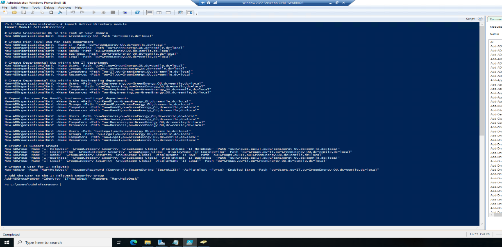
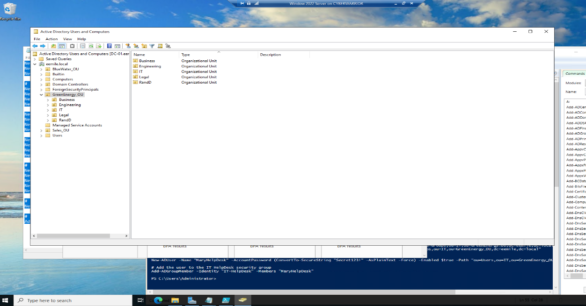

# AD Design Automation with PowerShell — GreenEnergy Case

An Active Directory organizational structure — departments, sub-OUs, security
groups, and a user — built entirely through PowerShell instead of the AD Users
and Computers GUI, verified on a live Windows Server 2022 domain controller.

## Why this exists

Clicking through the GUI to build an OU structure works for one-off changes,
but it doesn't scale — provisioning the same structure for a second domain, or
rolling out a template for every new department, means doing the same clicks
dozens of times. Scripting it means the whole structure is repeatable,
version-controllable, and auditable as actual code instead of a sequence of
manual steps nobody wrote down.

## What the script does

Using the `ActiveDirectory` PowerShell module:

1. **Creates a root OU** — `GreenEnergy_OU` at the domain root
2. **Creates five department-level OUs** under it — IT, Engineering, R&D,
   Business, and Legal
3. **Creates a consistent sub-OU structure inside each department** — Users,
   Groups, Computers, and Resources — so every department follows the same
   organizational pattern rather than five inconsistent, ad-hoc layouts
4. **Creates department-scoped security groups** — `IT-HelpDesk`,
   `IT-Engineering`, `IT-R&D`, `IT-Business`, `IT-Legal`
5. **Creates a user** (`MaryHelpdesk`) and adds them to the `IT-HelpDesk`
   group, demonstrating the full path from OU creation through group
   membership in one script

## Verified result

The resulting structure, confirmed in Active Directory Users and Computers —
`GreenEnergy_OU` at the root with all five department OUs (Business,
Engineering, IT, Legal, RandD) created exactly as scripted:

## A real challenge working through this

Individually scripting each OU, group, and user is straightforward, but
getting the **paths right** was not. Every `New-ADOrganizationalUnit` and
`New-ADGroup` call depends on an exact, correctly nested distinguished-name
path (e.g., `"ou=Users,ou=IT,ou=GreenEnergy_OU,dc=eemile,dc=local"`), and a
single wrong OU name or misordered path segment fails silently or creates the
object in the wrong location. Verifying every department's path manually
against the actual domain structure, rather than assuming the pattern held,
was the actual work here — the scripting syntax itself was the easy part.

## What this demonstrates

- Automating AD provisioning instead of relying on repetitive manual GUI work
- Understanding AD distinguished-name path structure well enough to debug it
  when a script targets the wrong location
- Extending a scripted structure end-to-end — OU creation, security groups,
  and actual user/group membership in one pass

## Background

Built as part of IFT 220 (Managing Configuration & Active Directory), B.S.
Information Technology (Cybersecurity focus), Arizona State University.
