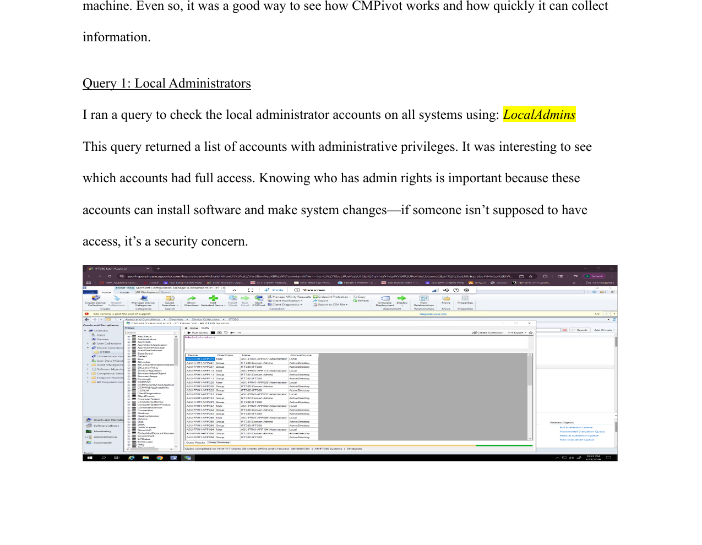
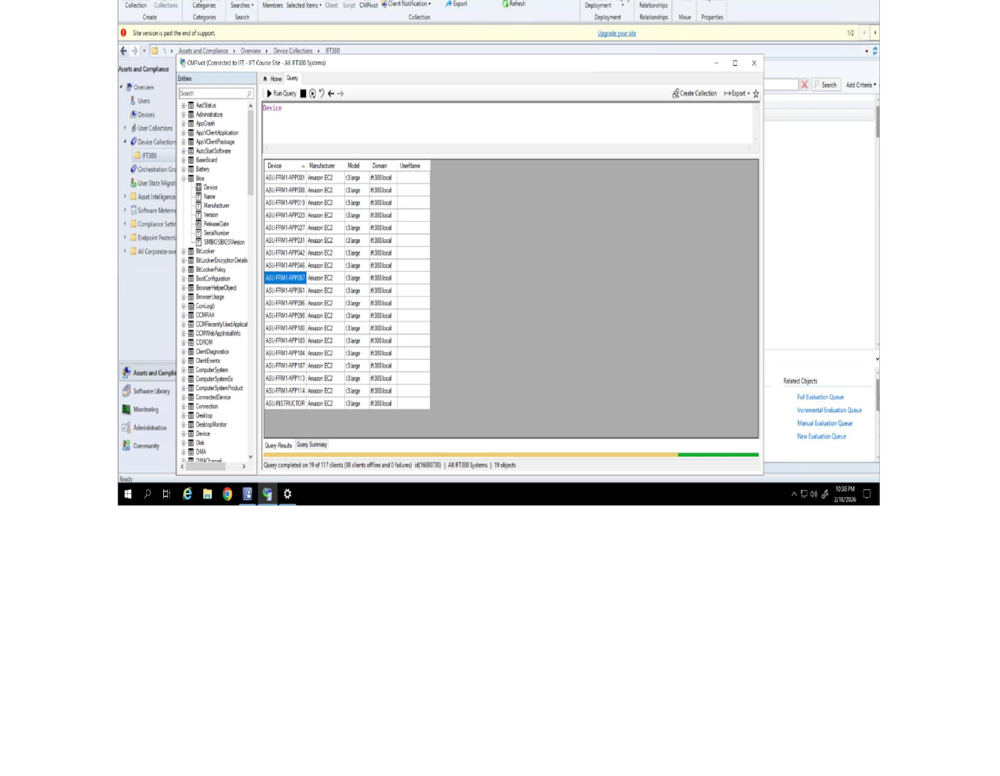
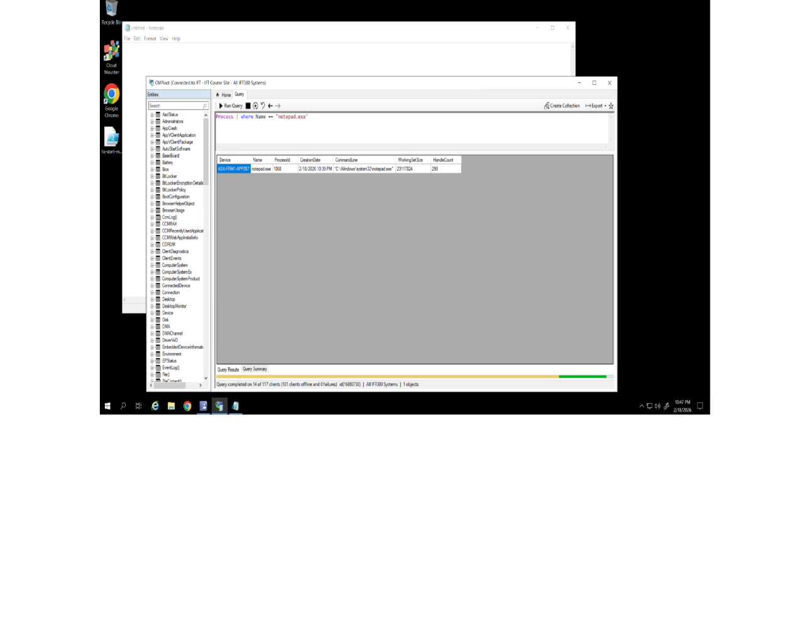

# 🔎 CMPivot — Live Device Queries

> Real-time device querying with SCCM's CMPivot: local admin auditing, hardware inspection, live process checks, installed software inventory, and disk space triage.

A hands-on SCCM lab using CMPivot to query live device data in real time, built and verified against an active Configuration Manager collection.

---

## 🎯 Objectives

This lab was designed to demonstrate the ability to:

* Query live device data in real time rather than relying on scheduled inventory cycles
* Use CMPivot for practical security and troubleshooting checks
* Scope a query to a single device using Device Pivot instead of an entire collection
* Recognize the difference between live CMPivot data and scheduled Resource Explorer inventory

---

## 🩺 Live Queries Run

**Local Administrators** — `LocalAdmins`, run across all systems in the collection. Returns every account with administrative privileges — a direct, practical way to catch an account that shouldn't have admin rights before it becomes a security incident.

**BIOS Information** — `BIOS`, run against a target VM. Returns BIOS version, manufacturer, and serial number — useful for hardware compliance checks and firmware-related troubleshooting, even with virtualized BIOS values on a VM.

**Running Process Check** — `Process | where Name == "notepad.exe"`, used to confirm a live, known process was actually running before trusting the query against something less obvious. Right-clicking the result surfaced **Device Pivot**, **Resource Explorer**, and **Remote Control** as direct next actions.

**Installed Software (via Device Pivot)** — using Device Pivot to scope `InstalledSoftware` to a single device instead of filtering a collection-wide result afterward. Returned a full, immediately usable software inventory for that one machine.

**Disk Space** — `Disk | where Description == 'Local Fixed Disk' | where isnotnull(FreeSpace) | order by FreeSpace asc`, sorted lowest-to-highest to immediately surface which systems in the collection were closest to running out of storage.

---

## 🔎 A Real Limitation Encountered

Most classmates' systems were offline at the time this lab was run, so live results came back mostly from one active PC and the instructor's machine rather than a full collection. This is a genuine, useful thing to understand about CMPivot going in: it queries **live, connected clients only** — it has no visibility into offline systems the way scheduled inventory does. A tool that only shows what's online right now is different from one that shows a complete historical picture, and knowing which one you're looking at matters when you're troubleshooting.

---

## 🧠 Key Concepts This Reflects

1. **Live vs. scheduled data** — CMPivot queries connected clients in real time; Resource Explorer reflects the last scheduled inventory cycle. Knowing which you're looking at changes how you interpret the result.
2. **Scoping a query correctly** — using Device Pivot to target one machine instead of filtering a broader result after the fact.
3. **Practical security use** — a local administrators query is a direct, low-effort way to catch unauthorized privilege before it's a problem.

---

## 🎓 Background

Developed while studying Advanced Systems Configuration Management as part of a B.S. in Information Technology, applied to a live device querying and triage scenario.
