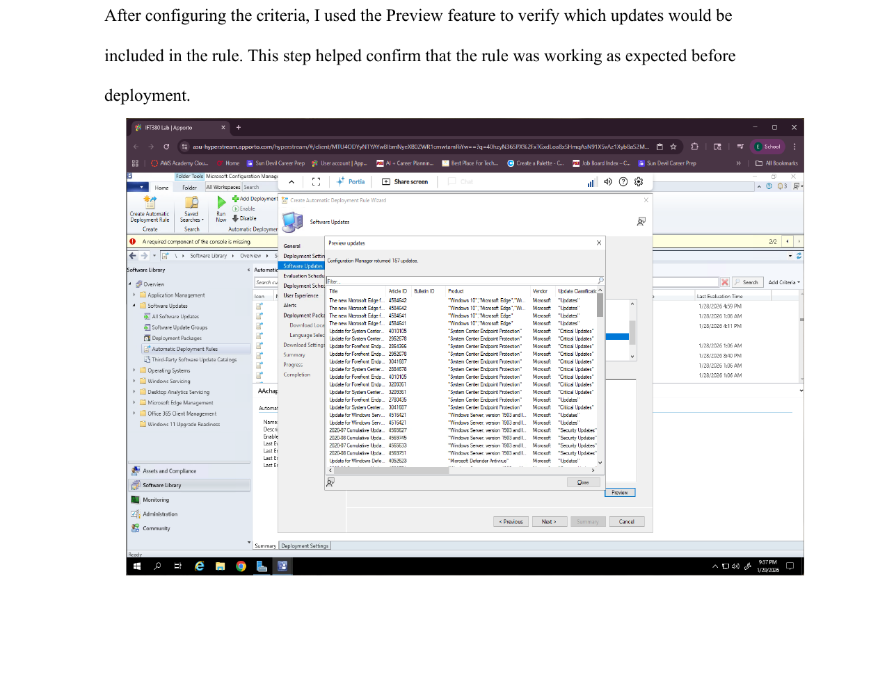
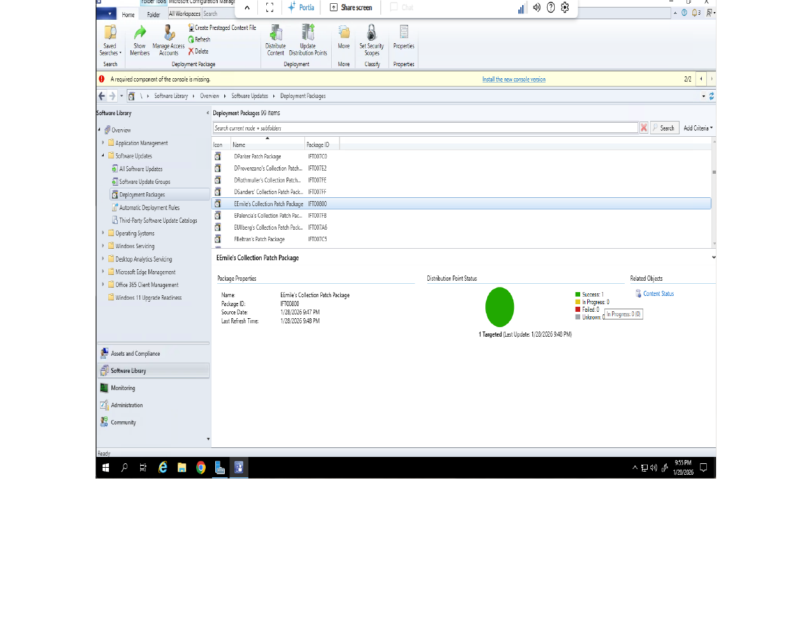
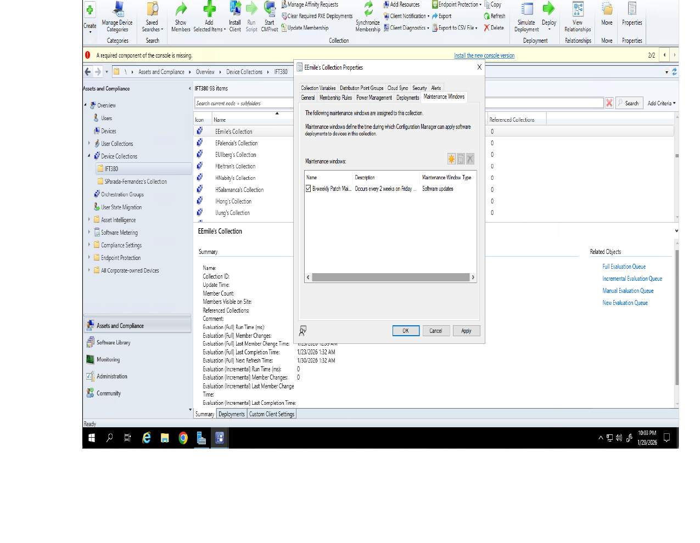

# 🩹 Patch Management — Automatic Deployment Rules

> Automated Windows Server patching using SCCM: Automatic Deployment Rules, update filtering criteria, deployment packages, and scheduled maintenance windows.

A hands-on SCCM (Microsoft Configuration Manager) lab configuring automatic patch deployment for Windows Server, built and verified in a live Configuration Manager console.

---

## 🎯 Objectives

This lab was designed to demonstrate the ability to:

* Review an existing Automatic Deployment Rule (ADR) before creating a new one
* Configure update classification and filtering criteria deliberately, not by accepting defaults
* Target deployments to a specific collection instead of the entire environment
* Schedule a maintenance window that balances security against user disruption

---

## 🏢 Environment

| Component | Configuration |
|---|---|
| Platform | Microsoft Configuration Manager (SCCM) |
| Target OS | Windows Server 2019 |
| Deployment Scope | Custom device collection |
| Update Classifications | Critical Updates, Security Updates |

---

## 🔍 1. Reviewing the Existing Endpoint Definitions ADR

Before creating a new rule, the existing **Endpoint Definitions ADR** was reviewed. This rule deploys endpoint protection definition updates to a broad collection — a deliberate choice, since those updates are low-risk, don't require reboots, and are released frequently. Deploying them broadly keeps systems protected without meaningfully increasing disruption risk.

---

## ⚙️ 2. Creating a New Automatic Deployment Rule

A new ADR was created and scoped to a **single custom device collection** rather than a broad target — limiting the blast radius of the deployment and reducing the risk of pushing updates to unintended systems.

**Filtering criteria configured:**

| Setting | Value |
|---|---|
| Classifications | Critical Updates, Security Updates |
| Primary Product | Windows Server 2019 |
| Superseded | No (excludes outdated, replaced updates) |
| Required | Yes (only updates the system actually needs) |

Updates were added to an **existing** Software Update Group rather than creating a new one each time — this keeps the group current over time and is more efficient for recurring patch cycles than starting fresh with every deployment.

Before deploying anything, the **Preview** feature was used to confirm which updates would actually be included — Configuration Manager returned 157 matching updates, verifying the rule's logic before it touched a single system.

---

## 📦 3. Deployment Package and Distribution

A deployment package was created and named after the target collection to keep patch files organized, with source files stored in a dedicated directory to avoid conflicts with other deployments. After distributing to the Lab Distribution Point and running the ADR, the Distribution Point Status confirmed a successful deployment — 1 targeted system, 0 failures.

---

## 🕐 4. Maintenance Window Configuration

A **Maintenance Window** was configured on a recurring bi-weekly schedule during late evening hours. This timing was a deliberate choice, not a default: updates for servers and managed systems should install when usage is lowest, reducing the chance of disrupting active users or services while still keeping systems current on security patches.

---

## 🧠 Key Concepts This Reflects

1. **Deliberate targeting** — deployments scoped to a specific collection, not applied broadly by default.
2. **Filtering with intent** — classification, superseded, and required filters chosen to deploy only what's actually needed.
3. **Verify before deploying** — using Preview to confirm rule logic against real update data before it reaches any system.
4. **Balancing security and availability** — scheduling updates for low-usage windows instead of treating patching and uptime as competing priorities to ignore.

---

## 🎓 Background

Developed while studying Advanced Systems Configuration Management as part of a B.S. in Information Technology, applied to a Windows Server patch management scenario.
