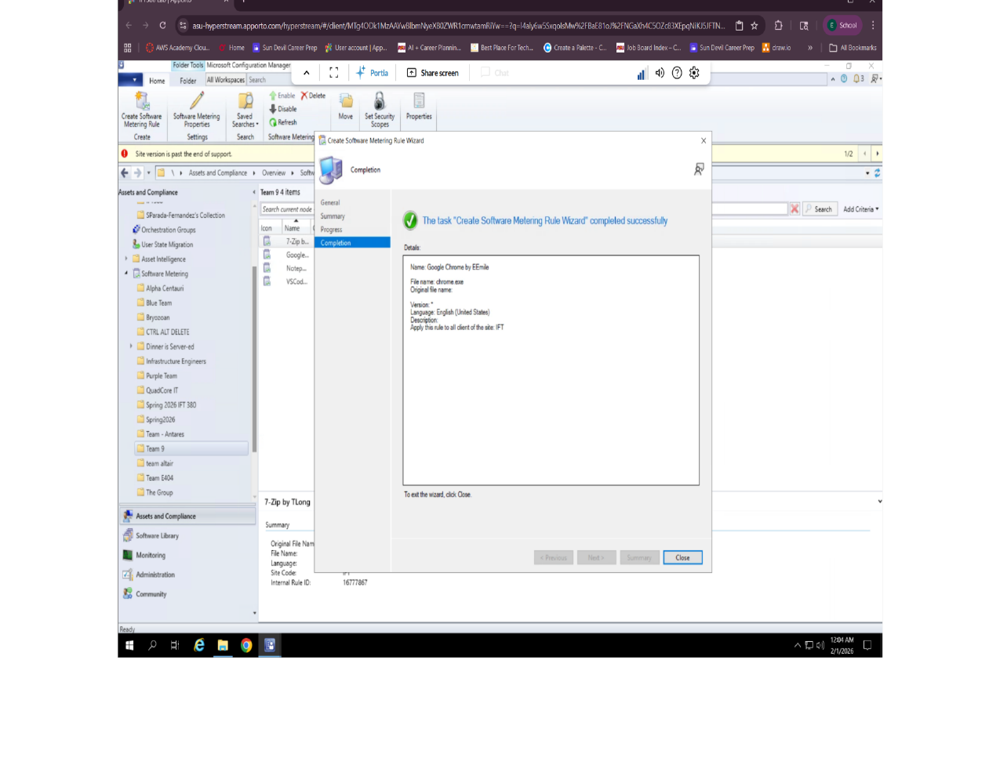

# 📊 Software Metering Rule — Application Usage Tracking

> Configuring SCCM Software Metering to track real-world application usage across a device collection.

A focused SCCM lab configuring a Software Metering Rule to track application usage, built and verified in a live Configuration Manager console.

---

## 🎯 Objectives

This lab was designed to demonstrate the ability to:

* Create a Software Metering Rule targeting a specific executable
* Correctly configure language and reporting settings so usage data is actually captured
* Verify a metering rule is active and correctly scoped after creation

---

## 🛠️ Configuration

A Software Metering Rule was created to track usage of **Google Chrome** (`chrome.exe`), selected directly from the program files directory rather than assumed by name.

**Key detail:** the rule's language setting was changed from **English** to **Any**. Without this change, the rule reports usage only for that exact language build — for an application like Chrome, where the installed build's language metadata doesn't always match assumptions, this is an easy way for a metering rule to silently report zero usage despite the application running constantly.

After configuration, the rule was verified as active and visible in the Software Metering Rules section of the console, alongside similar rules tracking other applications (7-Zip, Notepad, VS Code) on the same collection.

---

## 🧠 Key Concepts This Reflects

1. **Configuration details matter** — a metering rule that looks correctly set up can still silently fail to capture data if a setting like language doesn't match the actual installed application.
2. **Verify, don't assume** — confirming the rule appeared correctly in the console rather than assuming the wizard completed as expected.

---

## 🎓 Background

Developed while studying Advanced Systems Configuration Management as part of a B.S. in Information Technology, applied to an application usage tracking scenario.
